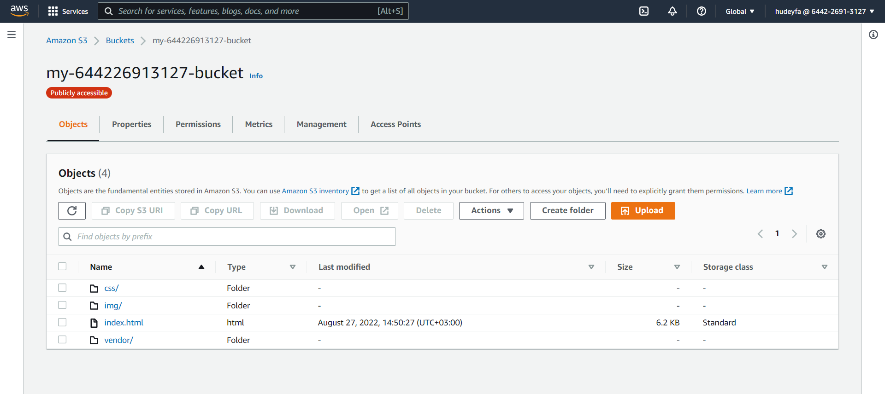
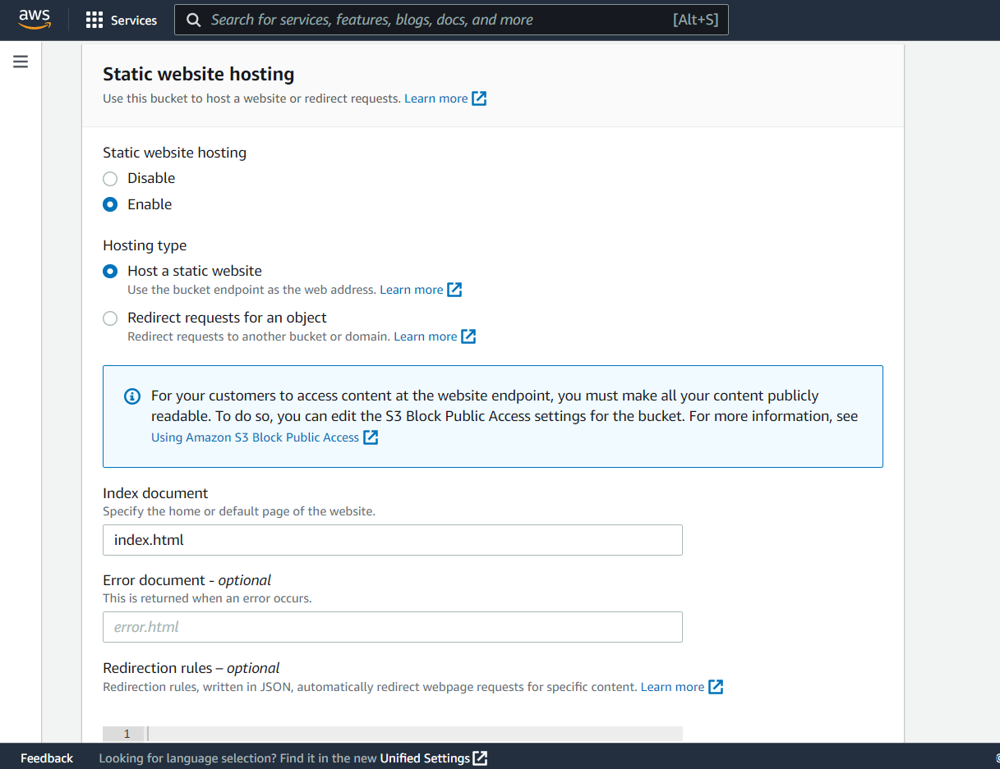
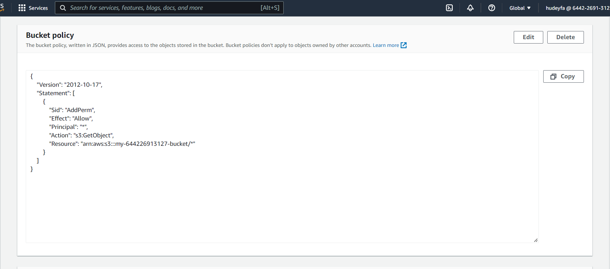
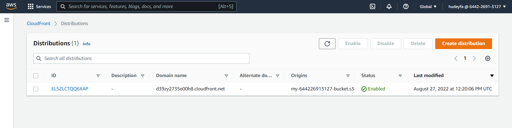

Deploy Static Website on AWS
============================

The cloud is perfect for hosting static websites that only include HTML, CSS, and JavaScript files that require no server-side processing. In this project I was tasked to deploy a static website to AWS. The whole project has two major intentions to implement:
- Hosting a static website on S3
- Accessing the cached website pages using CloudFront content delivery network (CDN) service  
> CloudFront offers low latency and high transfer speeds during website rendering.  

### Prerequisites
- AWS Account
- [Student-ready starter code](https://drive.google.com/open?id=15vQ7-utH7wBJzdAX3eDmO9ls35J5_sEQ) - Download and unzip this file.
> Note that I have customized the starter code by changing the website title and background image.  

### Topics Covered
- S3 bucket creation
- S3 bucket configuration
- Website distribution via CloudFront
- Access website via web browser  

### Steps
In order to host the website on AWS, I’ve performed the following steps:
1.	Create a public S3 bucket and upload the website files to the bucket.  
As you can see from the screenshot below, the bucket is visible in the AWS Management console, showing all the website files uploaded to it.  

  
 
 
2.	Configure the bucket for website hosting and secure it using IAM policies.  
The screenshot below shows the S3 bucket is configured to support static website hosting.  

  
 
 
3.  Allow public access to the bucket.  
The S3 bucket has an IAM bucket policy that makes the bucket contents publicly accessible.  
  
  
 
 
4.	Set up AWS’s CloudFront distribution to speed up content delivery.  
CloudFront has been configured to retrieve and distribute website files as shown in the screenshot below.  
  
  
 
 
5.	Access the website in a browser using the unique CloudFront endpoint.  
To make sure the deployment was successful, I’ve accessed the website in my browser. You can see the website is live and accessible to anyone on the Internet via a web browser.

  
